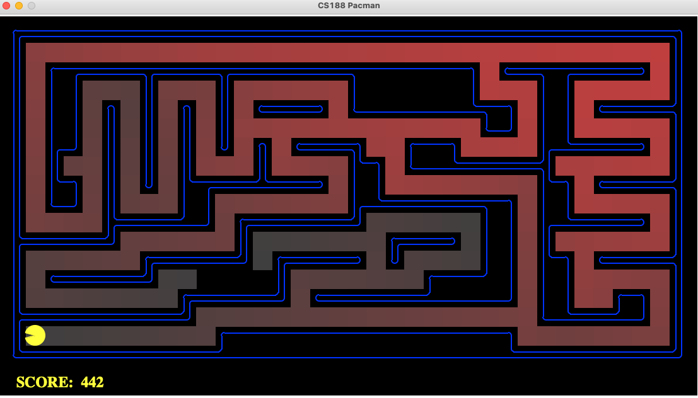
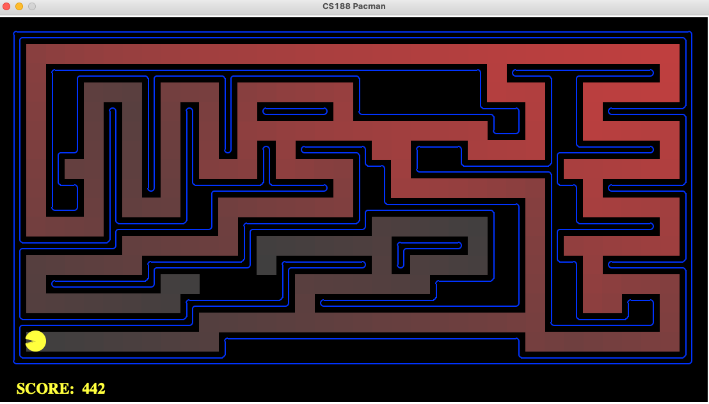
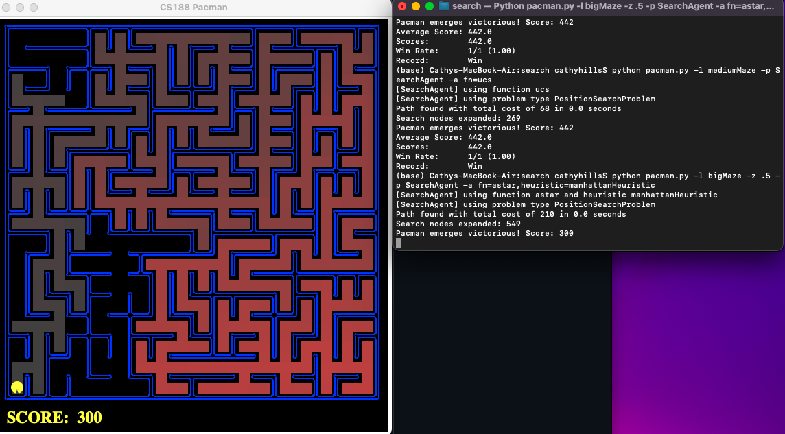

# CS205 Aritifical Intelligence Pacman Project - Bryce Hills


## Motivation

* In this project, the Pacman agent will find paths through his maze world, both to reach a particular location and to collect food efficiently. We build general search algorithms and apply them to Pacman scenarios:
  - Breadth First Search
  - Depth First Search
  - Uniform Cost Search
  - A Star Algorithm
  - Implementing a Representation of the Corners Problem
  - Corners Problem Heuristic
  - Eating All Dots Heuristic
  - Greedy Search - (Finding out why this is suboptimal for the eating problem)
* Main Idea
  - Implement search algorithms and heuristics in a real world example to get a better idea of where each one can succeed or fail.
  - Understanding Admissibility vs. Consistency with respect to heuristics
  - Learning how to represent a game as a searchable set of states for search algorithms
 
## File Breakdown
* Main Files:
  * search.py - 	Where all of your search algorithms will reside.  
  * searchAgents.py - 	Where all of your search-based agents will reside.
* Files to Pay Attention to:
  * pacman.py	- The main file that runs Pacman games. This file describes a Pacman GameState type, which you use in this project.  
  * game.py -	The logic behind how the Pacman world works. This file describes several supporting types like AgentState, Agent, Direction, and Grid.  
  * util.py	- Useful data structures for implementing search algorithms.  
* Supporting files you can ignore:  
  * graphicsDisplay.py -	Graphics for Pacman  
  * graphicsUtils.py	- Support for Pacman graphics  
  * textDisplay.py	- ASCII graphics for Pacman  
  * ghostAgents.py	- Agents to control ghosts  
  * keyboardAgents.py	- Keyboard interfaces to control Pacman  
  * layout.py	- Code for reading layout files and storing their contents  
  * test_cases/	- Directory containing the test cases for each question  
  * searchTestClasses.py	- Project 1 specific autograding test classes  

## How To Use


```bash
After downloading the code (search.zip), unzipping it, and changing to the directory, you should be able to play a game of Pacman by typing the following at the command line:

python pacman.py

Run a pacman agent on a particular board by using the general form: python pacman.py --layout (maze) --pacman (agent)

In order of parts 1 - 8, the commands are as follows:
-----------------------------------------------------
python pacman.py -l tinyMaze -p SearchAgent
python pacman.py -l mediumMaze -p SearchAgent -a fn=bfs
python pacman.py -l mediumMaze -p SearchAgent -a fn=ucs
python pacman.py -l bigMaze -z .5 -p SearchAgent -a fn=astar,heuristic=manhattanHeuristic
python pacman.py -l mediumCorners -p SearchAgent -a fn=bfs,prob=CornersProblem
python pacman.py -l mediumCorners -p AStarCornersAgent -z 0.5
python pacman.py -l trickySearch -p AStarFoodSearchAgent
python pacman.py -l bigSearch -p ClosestDotSearchAgent -z .5
```

# Screenshots & revelant info of project below:
---

## Question 1
#### Screenshots of successful runs:
```python
python pacman.py -l tinyMaze -p SearchAgent
```

  

```bash
$ python pacman.py -l mediumMaze -p SearchAgent
[SearchAgent] using function depthFirstSearch
[SearchAgent] using problem type PositionSearchProblem
Path found with total cost of 130 in 0.0 seconds
Search nodes expanded: 144
Pacman emerges victorious! Score: 380
Average Score: 380.0     
Scores:        380.0     
Win Rate:      1/1 (1.00)
Record:        Win  
```

#### Answers to questions posted in [Question 1](http://ai.berkeley.edu/search.html#Q1):
* The Pacman board will show an overlay of the states explored, and the order in which they were explored (brighter red means earlier exploration). Is the exploration order what you would have expected? 
  * There are cases where pacman starts with only one possible direction and the nodes that correspond to that direction are explored first. This makes sense since DFS expands depth first.
  * Other cases where Pac-Man can move in multiple directions and it expands a specific direction first is also expected if we assume that direction is the first added to the actions.
  * Overall it is expected since DFS will explore nodes depth-wise once initialized with the start node. 
* Does Pacman actually go to all the explored squares on his way to the goal?
  * No, many explored nodes are not traversed on the way to the goal for all board sizes. 
* Is this a least-cost solution? If not, think about what depth-first search is doing wrong.
  * No, dfs does not take the cost of explored nodes into account in terms of adding to the data structure, thus the order in which nodes are added to the data structure could be more optimal.


## Question 2
#### Screenshots of successful runs:
```python
python pacman.py -l mediumMaze -p SearchAgent -a fn=bfs
```

  

```bash
$ python pacman.py -l mediumMaze -p SearchAgent -a fn=bfs
[SearchAgent] using function bfs
[SearchAgent] using problem type PositionSearchProblem
Path found with total cost of 68 in 0.0 seconds
Search nodes expanded: 269
Pacman emerges victorious! Score: 442
Average Score: 442.0     
Scores:        442.0     
Win Rate:      1/1 (1.00)
Record:        Win     
```


## Question 3
#### Screenshots of successful runs:
```python
python pacman.py -l mediumMaze -p SearchAgent -a fn=ucs
```

  

```bash
$ python pacman.py -l mediumMaze -p SearchAgent -a fn=ucs
[SearchAgent] using function ucs
[SearchAgent] using problem type PositionSearchProblem
Path found with total cost of 68 in 0.0 seconds
Search nodes expanded: 269
Pacman emerges victorious! Score: 442
Average Score: 442.0     
Scores:        442.0     
Win Rate:      1/1 (1.00)
Record:        Win   
```

## Question 4
#### Screenshots of successful runs:
```python
python pacman.py -l bigMaze -z .5 -p SearchAgent -a fn=astar,heuristic=manhattanHeuristic
```

  


## Credits

* http://ai.berkeley.edu/search.html#Q8

---

> GitHub [@brycehills](https://github.com/brycehills) &nbsp;&middot;&nbsp;
> LinkedIn [@brycehills](https://www.linkedin.com/in/brycehills1/)

